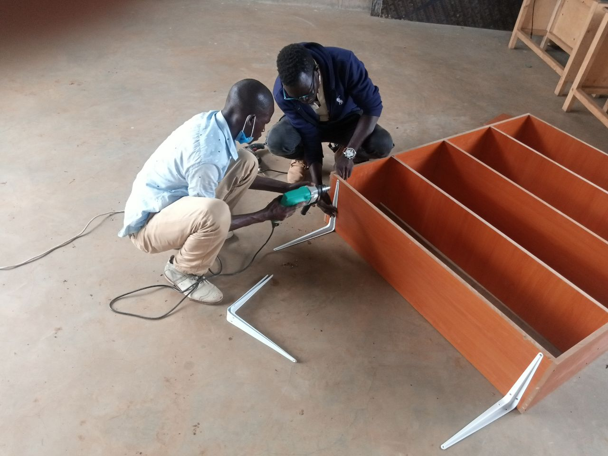
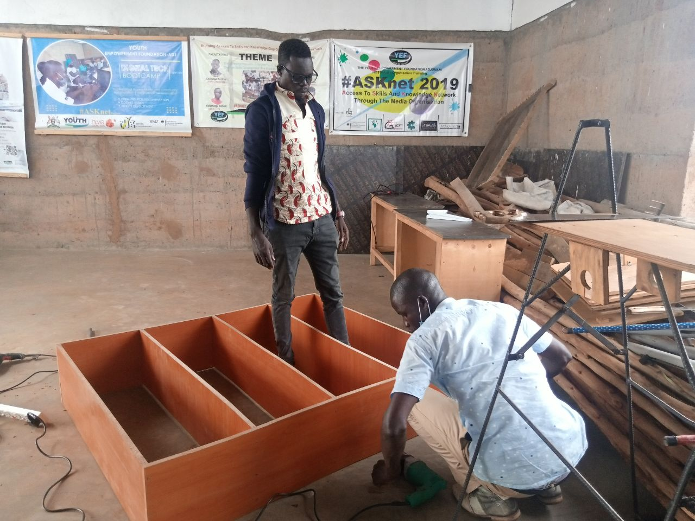
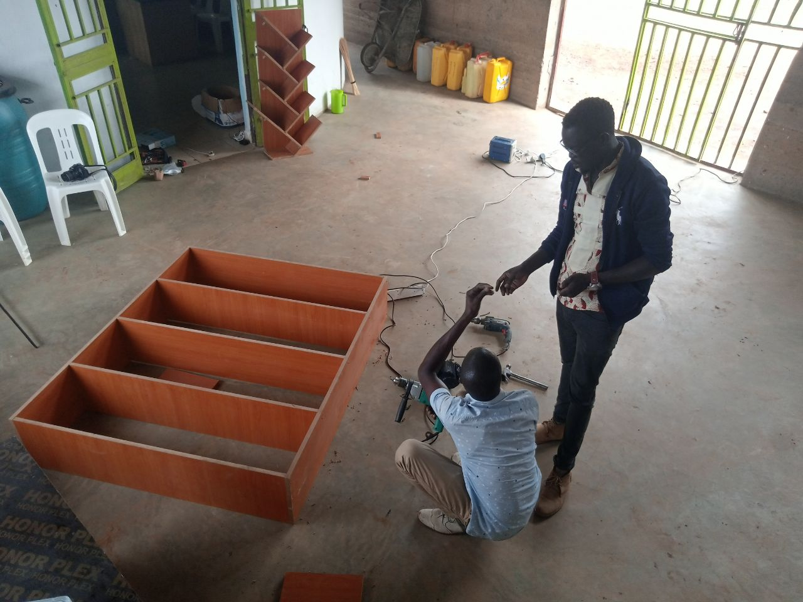
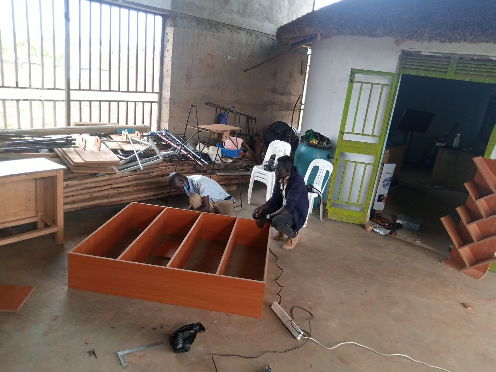
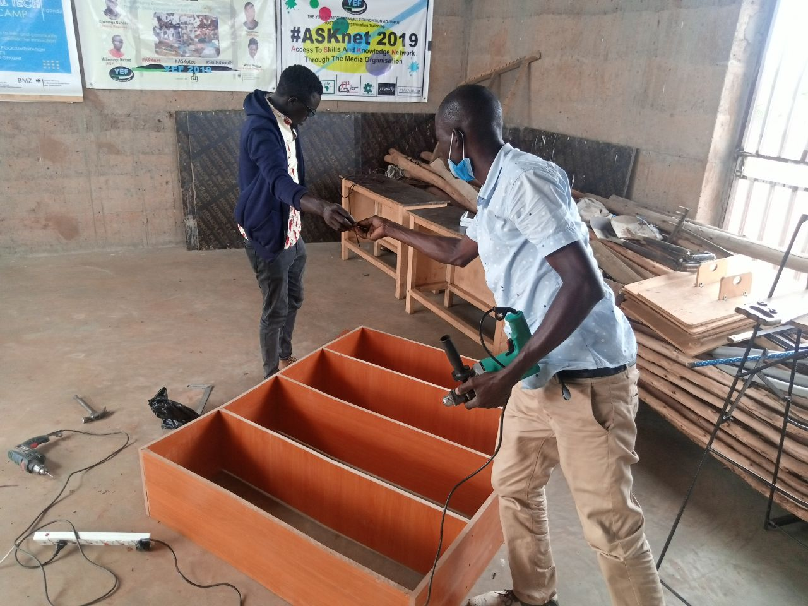

# tittle making-a-bookshelf

A bookshelf is a piece of furniture with horizontal shelves used to store books or other printed materials. 

Bookshelves are used in libraries,offices,homes,public universities and book stores.

 # Aims/Objectives
1.To store books and files containing reports of the activities excuted by the organisation.These includes;
- Accounting information
- Evaluation reports of projects
- Project proposal to mention but a few.
# Tools
- Tape measure, 3m,5m,10m etc depending on the size of shelf you intend to make.

